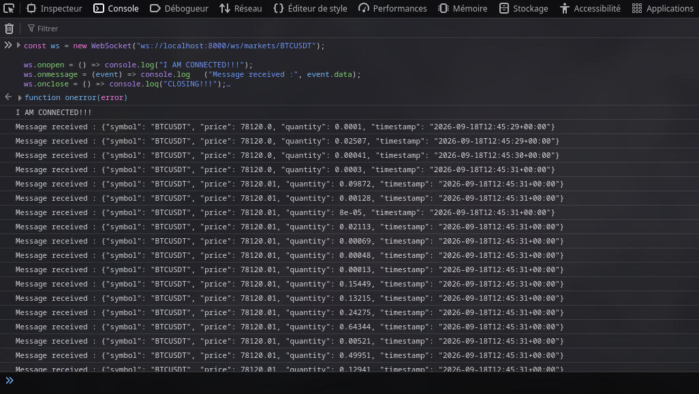
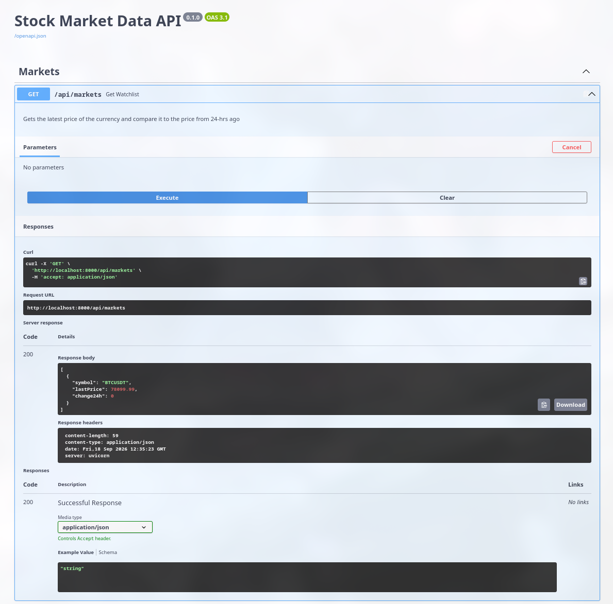
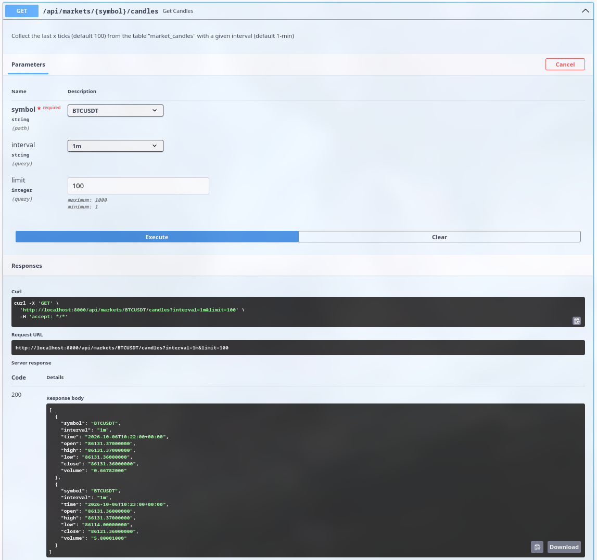
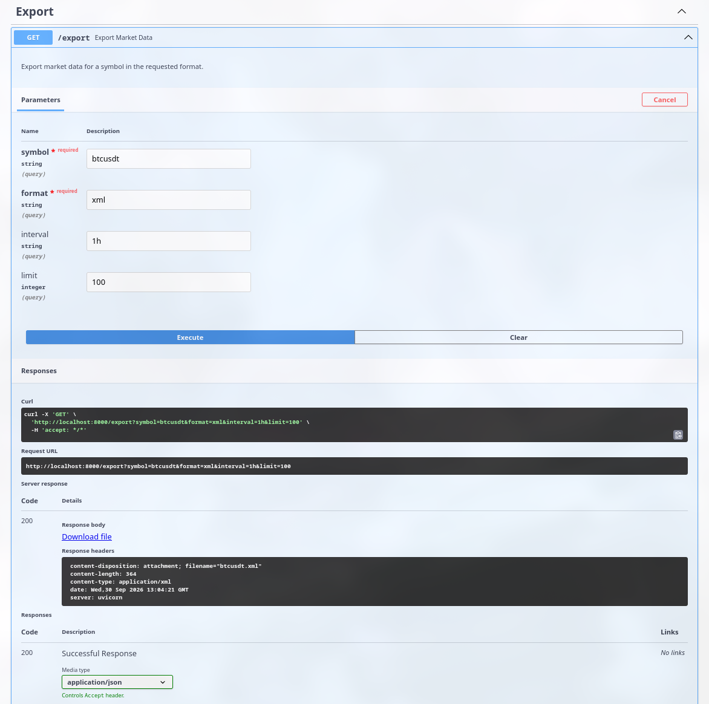

# API Server Backend

This service acts as the interface between the ingestion layer and the frontend. It provides the market data needed by the user interface through both HTTP endpoints and real-time WebSocket streaming, while keeping the presentation layer decoupled from the underlying Redis and PostgreSQL systems.

## Stack

The API server is built with:

- FastAPI for the web application and routing
- SQLAlchemy with asynchronous PostgreSQL access
- Redis Pub/Sub for live market updates
- WebSockets for broadcasting streaming data to frontend clients
- Pydantic-based validation models for structured API responses

This stack is designed to support both:

- live market updates for the frontend dashboard;
- historical candle and watchlist data for charts and market summaries.

## How the structure works

The API server is a real-time market data layer that connects the ingestion pipeline to the frontend. Its role is to bridge three things together:

- Redis, which holds the live stream of market updates;
- PostgreSQL, which stores the structured market history and candle data;
- the browser, which consumes live prices and chart data through REST and WebSocket endpoints.

At a high level, the architecture is simple:

1. The ingestion layer publishes raw market updates to Redis.
2. The API server starts a Redis subscription during its FastAPI lifespan.
3. Each incoming message is broadcast to all active WebSocket clients.
4. The frontend receives live prices in real time through `/ws/markets/{symbol}`.
5. The REST layer reads the latest watchlist data and the candle history from PostgreSQL for the dashboard and charts.

This separation keeps the system efficient: the live stream stays lightweight and responsive, while the database is used for persistent and historical data access.

## Application startup and lifecycle

The API server initializes itself in a controlled async lifecycle defined in `main.py`.

During startup, it:

- creates the Redis connection pool using the values loaded from `config.py`;
- opens the Redis client;
- subscribes to the channel used by the ingestion layer (`market_ticks_channel`);
- starts a background listener task to process incoming stream messages;
- yields control to FastAPI so HTTP and WebSocket routes can run.

When the app shuts down, it cancels the listener task and closes the Redis pool cleanly. This ensures the server is ready to stream data as soon as it starts, without reconnecting on every request.

The important part is that the Redis listener is not part of the request path. It runs in the background while the application remains available to serve both REST and WebSocket traffic.

## WebSocket and live streaming flow

The live WebSocket pipeline is managed through a central `ConnectionManager` in `utils/connection_manager.py`.

That manager is responsible for:

- accepting client connections;
- keeping a set of currently connected sockets;
- removing disconnected clients;
- sending incoming messages to every active client.

In practice, the flow is:

- a browser opens `/ws/markets/{symbol}`;
- the server accepts the connection and stores it in the manager;
- Redis publishes a new market update;
- the background subscriber receives it;
- the manager broadcasts it to all clients connected to that endpoint.

This gives the frontend a push-based market stream without continuous polling.

## REST layer and data access

The HTTP layer in `routers/markets.py` provides the data the UI needs outside the live stream:

- the watchlist endpoint returns the latest price and 24-hour variation for tracked currencies;
- the candle endpoint returns historical OHLC data for chart rendering.

These endpoints read from PostgreSQL, while the live stream itself is powered by Redis. In other words, Redis is used for immediate updates, and PostgreSQL is used for structured, persistent market history.

## Global architecture summary

The API server behaves like a presentation layer for the market data platform:

- Redis powers the real-time event stream;
- PostgreSQL stores the structured market state and historical trend data;
- WebSockets deliver live updates to the browser;
- REST endpoints expose watchlist and chart data to the frontend.

This design makes the service easy to manage globally: it keeps the live pipeline fast, the historical data accessible, and the frontend independent from the underlying storage and streaming systems.

## Debug and testing

### WebSocket validation

To confirm that the socket is working, inspect the API logs:

```bash
podman logs -f transcendence_api_server
```

Then open the app in a browser and run:

```js
const ws = new WebSocket("ws://localhost:8000/ws/markets/BTCUSDT"); // You can replace BTCUSDT by other currency

ws.onopen = () => console.log("Connected!");
ws.onmessage = (event) => console.log("Message received:", event.data);
ws.onclose = () => console.log("Closing...");
ws.onerror = (error) => console.log("ERROR:", error);
```

If the ingestion service is publishing to Redis and the API server is subscribed correctly, the browser should receive live updates.  

Here's what it should looks like:



### Watchlist validation

Open the API documentation:

```text
http://localhost:8000/docs
```

Then call `GET /api/markets` to verify the current price and the 24-hour change are returned in JSON.  

Here's what it should look like:



### Candle validation

The candle endpoint is used to return the OHLC time series for the charting UI. A typical test involves:

- selecting a currency symbol;
- choosing an interval such as `1m` or `15m`;
- setting a limit for the data points;
- validating that the response contains the series required to render the chart correctly.

Open the API documentation:

```text
http://localhost:8000/docs
```

Then call `GET /api/markets{symbol}/candles` to check the OHLC of the currency of your choice.

Here's what it should look like:



Where in:
- <u>*symbol*</u>, you write the currency available (`BTCUSDT`, `ETHUSDT`, `SOLUSDT`, `XRPUSDT`, `ADAUSDT`).  
- <u>*interval*</u>, you choose the interval difference between each OHLC data, default 1min (note that if you have just started the containers, for example, you will need to wait until *xx:15/30/45* for 15m interval or *xx:00* for 1h interval and etc... before the data is saved to the database).  
- <u>*limit*</u>, you can choose how many OHLC data it displays, default 100.

### Export

The API server also supports exporting market data for a single symbol in multiple formats. At the moment, `json`, `csv`, and `xml` are available for export.

This can be done either from the frontend export button or directly through the FastAPI documentation. The following steps describe the API-based method.

Open the API documentation:

```text
http://localhost:8000/docs
```

Then call `GET /export` and provide the parameters of your choice.
Available arguments for each variable:  
- symbol: `BTCUSDT`, `ETHUSDT`, `SOLUSDT`, `XRPUSDT`, `ADAUSDT`
- format: `json`, `csv`, `xml`
- interval: `1m`, `15m`, `1h`, `4h`, `1d`, `1w`
- limit: positive integer

The response format depends on the selected export type: for `json`, the endpoint returns the data as a JSON string, while `csv` and `xml` responses are returned as downloadable files in the requested format.

Here's what it should look like (with .xml):


